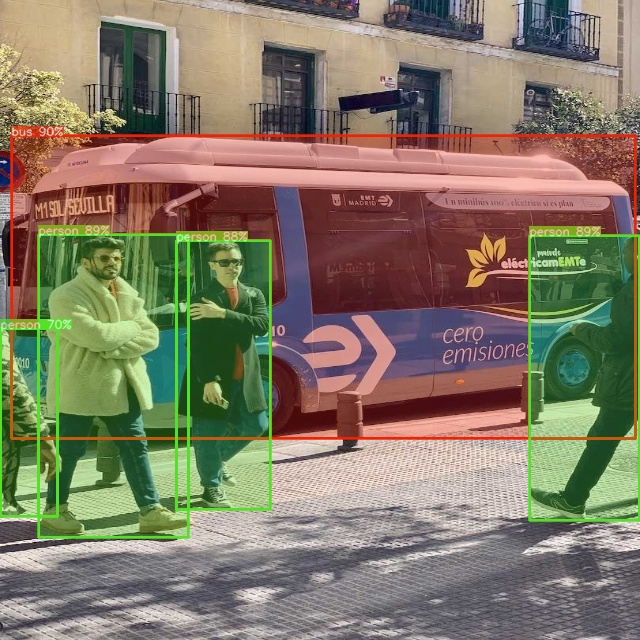
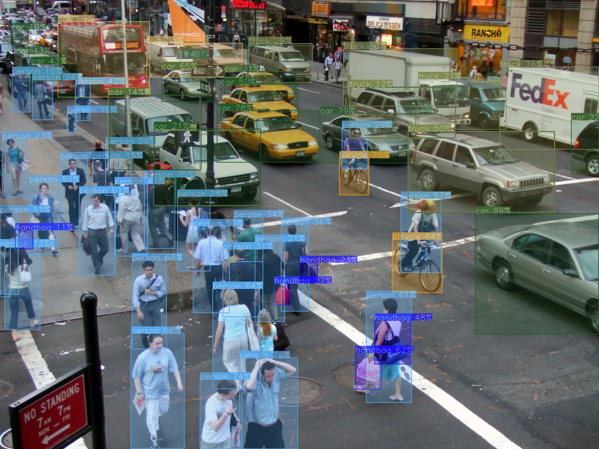

# Important
- The input images are directly resized to match the input size of the model. I skipped adding the pad to the input image, it might affect the accuracy of the model if the input image has a different aspect ratio compared to the input size of the model. Always try to get an input size with a ratio close to the input images you will use.

# Requirements

 * Check the **requirements.txt** file.
 * For ONNX, if you have a NVIDIA GPU, then install the **onnxruntime-gpu**, otherwise use the **onnxruntime** library.

# Installation
```shell
git clone https://github.com/SihabSahariar/Yolov11-ONNX-Object-Detection.git
cd Yolov11-ONNX-Object-Detection
pip install -r requirements.txt
```
### ONNX Runtime
For Nvidia GPU computers:
`pip install onnxruntime-gpu`

Otherwise:
`pip install onnxruntime`

# ONNX model
Use the Google Colab notebook to convert the model: [](https://colab.research.google.com/drive/1H7xT_wVu3fXBIulWvvgu5pxuCkV_nNQN?usp=sharing)

You can convert the model using the following code after installing ultralytics (`pip install ultralytics`):
```python
from ultralytics import YOLO

model = YOLO("yolov11n.pt") 
model.export(format="onnx", imgsz=[480,640])
```

# Original YOLOv11 model
The original YOLOv11 model can be found in this repository: [YOLOv11 Repository](https://github.com/ultralytics/ultralytics)
- The License of the models is GPL-3.0 license: [License](https://github.com/ultralytics/ultralytics/blob/main/LICENSE)

# Examples

 * **Image inference**:
 ```shell
 python image_object_detection.py
 ```

 * **Webcam inference**:
 ```shell
 python webcam_object_detection.py
 ```

 * **Video inference**:
 ```shell
 python video_object_detection.py
 ```


 

# References:
* YOLOv11 model: [https://github.com/ultralytics/ultralytics](https://github.com/ultralytics/ultralytics)
* YOLOv8 model: [https://github.com/ultralytics/ultralytics](https://github.com/ultralytics/ultralytics)
* PINTO0309's model zoo: [https://github.com/PINTO0309/PINTO_model_zoo](https://github.com/PINTO0309/PINTO_model_zoo)
* PINTO0309's model conversion tool: [https://github.com/PINTO0309/openvino2tensorflow](https://github.com/PINTO0309/openvino2tensorflow)
* ONNX YOLOv8 Object Detection: [https://github.com/ibaiGorordo/ONNX-YOLOv8-Object-Detection](https://github.com/ibaiGorordo/ONNX-YOLOv8-Object-Detection)
